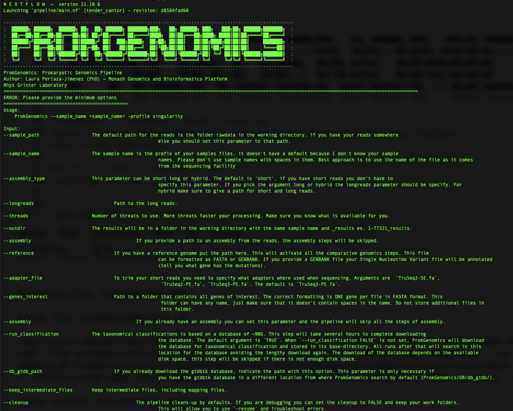

# Run Pipeline

Remember to put the [program in your $PATH ](getting-started.html) if you haven't done it. This step has to be done every time you start a new terminal session. If you want to make this change permanent you could modify your [bash profile](https://stackoverflow.com/questions/14637979/how-to-permanently-set-path-on-linux-unix) (don't play around with it if you don't feel confident about it)

If you added the program to your ```$PATH``` successfully you should be able to run

```
#remember to activate the conda env if you are using one
conda activate ProkGenomics_ENV

#run the pipeline
ProkGenomics

```

If ProkGenomics starts correctly, you will see something like:



If you don't see a version of that go to [troubleshoot](troubleshooting.html) to look for possible solutions


## Simple run

```
#remember to activate the conda env if you are using one, and if you haven't activated it yet
conda activate ProkGenomics_ENV

#run the pipeline
ProkGenomics -profile singularity --sample_name '1-77321' 

```


## Include comparative genomcis steps

```
#remember to activate the conda env if you are using one, and if you haven't activated it yet
conda activate ProkGenomics_ENV

#run the pipeline
ProkGenomics -profile singularity --sample_name '1-77321' --reference reference.fasta 

```


## Include characterization of genes of interest

```
#remember to activate the conda env if you are using one, and if you haven't activated it yet
conda activate ProkGenomics_ENV

#run the pipeline
ProkGenomics -profile singularity --sample_name '1-77321' --genes_interest GenesDB 

```


## Run all steps

```
#remember to activate the conda env if you are using one, and if you haven't activated it yet
conda activate ProkGenomics_ENV

#run the pipeline
ProkGenomics -profile singularity --sample_name '1-77321'--reference reference.fasta --genes_interest GenesDB 

```

**Parameters you can use:**

|Command|Description|
| :---|:---- |
|`--sample_path` *./rawdata/*|  The default path for the reads is the folder rawdata in the working directory (please follow the instructions for [setting up the working folder](getting-started.html)). if you have your reads somewhere else you should set this parameter to that path. |
|`--sample_name` *1-77321*|The sample name is the prefix of your samples files. it doesn't have a default because I don't know your sample names. Please don't use sample names with spaces in them. Best approach is to use the name of the file as it comes from the sequencing facility|
|`--assembly_type` *short*|This parameter can be short long or hybrid. The default is 'short'. if you have short reads you don't have to specify this parameter. If you pick the argument long or hybrid the longreads parameter should be specify. For hybrid make sure to give a path for short and long reads. | 
|`--longreads`  *./rawdata/longreads/*|Path to the long reads. |  
|`--threads` *16*|Number of threats to use. More threats faster your processing. Make sure you know what is available for you.|
|`--outdir` *1-77321*|The results will be in a folder in the working directory with the same sample name and _results ex. 1-77321_results.| |`--assembly`|if you provide a path to an assembly from the reads, the assembly steps will be skipped.|
|`--reference` *ReferenceGenome.fasta or ReferenceGenome.gbk*|If you have a reference genome put the path here. This will activate all the comparative genomics steps. This file can be formatted as FASTA or GENBANK. If you provide a GENBANK file your Single Nucleotide Variant file will be annotated (tell you what gene has the mutations). The use of GENBANK files work only when the file has also the fasta sequence at the end of it. In the NCBI download the `Genbank (full)` option|
|`--adapter_file` *TruSeq3-PE.fa*|To trim your short reads you need to specify what adaptors where used when sequencing. Arguments are  `TruSeq2-SE.fa`, `TruSeq2-PE.fa`, `TruSeq3-PE.fa`. The default is `TruSeq3-PE.fa`.  |
|`--genes_interest` *GenesDB/*|Path to a folder that contains all genes of interest. The correct formatting is ONE gene per file in FASTA format. This folder can have any name, just make sure that it doesn't contain spaces in the name. Do not store additional files in this folder that are not genes of interest|
|`--assembly` *genome_assembly.fasta*|If you already have an assembly you can set this parameter and the pipeline will skip all the steps of assembly|
|`--run_classification` *FALSE*| The taxonomical classifications is based on a database of ~90G. This step will take several hours to complete downloading the database. The default argument is `TRUE`. When `--run_classification FALSE` is not set, ProkGenomics will download the database for taxonomical classification and stored in its base-directory. All runs after that will search in this location for the database avoiding the lengthy download again. The download of the database depends on the available disk space, this step will be skipped if there is not enough disk space |
|`--db_gtdb_path` */path/gtdb/existing/database*| If you already download the gtdbtk database, indicate the path with this option. This parameter is only necessary if you have the gtdbtk database in a different location from where ProkGenomics search. Default is ProkGenomics/DB/db_gtdb/, so if you have your db_gtdb in that location, you don't have to specify any path|
|`--keep_intermediate_files`|Keep all intermediate files, including mapping files|
|`--cleanup FALSE`|The pipeline cleans-up by defaults. If you are debugging you can set the cleanup to FALSE and keep your work folders. This will allow you to use `-resume` and troubleshoot errors|

