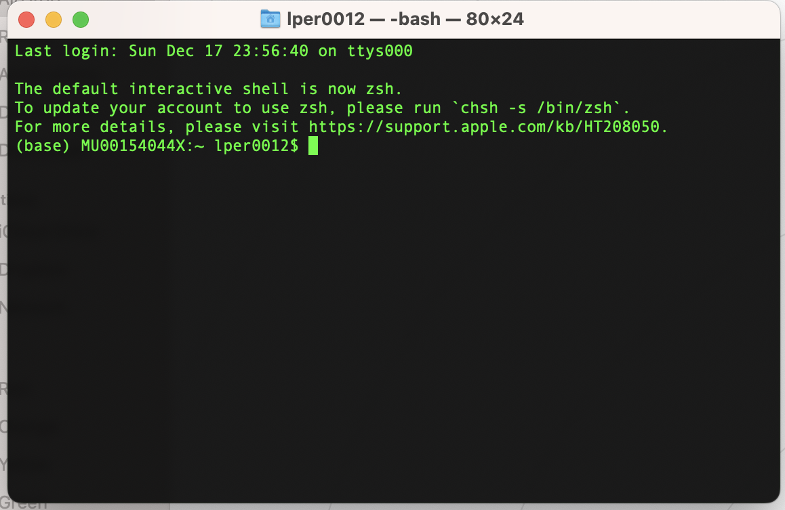
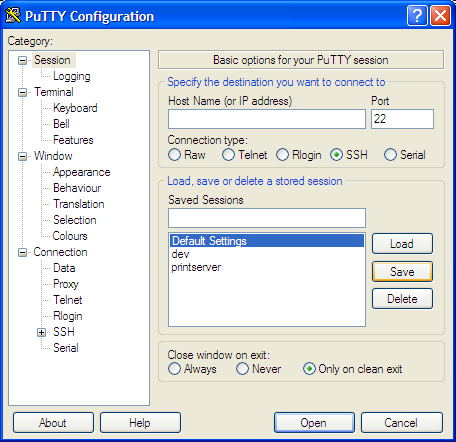

# Command Line Intro

If you are completely new to working with command line the following short introduction should be useful to get you started. Please read carefully this section, it will help you to understand instructions in later sections.  

## General syntax and conventions:

•	Code or command are instructions directly given to the computer through a console or terminal window. Code or command lines in this tutorial are written with ```this style``` or 

```
in this boxes
```


•	If a string is written between < > it means that you have to type what that means in your case. For example: Login as: ```<your username>``` this means you have to type your user name in that space without the ```< >```

For example, the following instructions should look like:

```
cp <file_name> <file_destination>
```

My file name os `myfile.txt` and my file destination is `newfolder`

```
cp myfile.txt newfolder

```

•	When asterisk ```*``` is used it means all of that kind. For example: ``` ls *.fasta```  will print a list of all files that have the extension .fasta  

•	Every line starting with ```#``` is a comment. There lines are not interpreted by your computer, there are there only to give you additional information. 


### Programs:

Command lines for executing programs usually looks like: 

```
program --input <inputfile>
``` 

where  
```program``` is the program in question  
```--input``` is the option or parameter  
```inputfile``` is the argument  


• Options/parameters for a program are denotated by a dash and a letter as:``` -f``` or a double dash and a string as: ```--file```. If an option is not required but optional is often explained using ```[ ]```, for example: ```[-t 8]```  

• Arguments are the input to the options/parameters. For example ```-f myfile.txt```. -f is the option to input your file and myfile.txt is the argument for that option, the name of your file. The arguments are often explained using < >. When several arguments are possible for an option pipes are used to show the different possibilities, for example  ```[-f sam|bam]```. This means the option ```-f``` allows sam or bam formats  

## Basic commands:

When you enter your terminal your prompt consists of: ```HOST_NAME:MACHINE CURRENT_DIRECTORY $``` everything after $ is your command line. You can use the following basic commands to access information or perform tasks in your computer. 


•  **c**hange **d**irectory  

```
cd <name of directory you want to change to>
```  


```cd``` or ```cd ~``` move you to your home directory


• **p**rint **w**orking **d**irectory  

```
pwd
```

•  **l**i**s**t your files  

```
ls
```  

•  **m**a**k**e **dir***ectory

```
mkdir <new folder name>
```  

• **c**o**p**y (needs file to be copied and destination).   

```
cp <path of file to be copy> <destination path>
``` 

## Files system

• Please note that directories are structured in a [hierarchical system](https://www.geeksforgeeks.org/structures-of-directory-in-operating-system/). You have to know where you are standing to ask the computer to move to the correct folder.

Example of folder structure:

```
           | subfolder_1 
           | 
main_folder
           |
           | subfolder_2
                        |
                        |subfolder_2.1 (YOU ARE HERE)

```


```
#where am I?

pwd

#shows this path: /main_folder/subfolder_2/subfolder_2.1

# I want to go to the folder conteining this folder

cd ..

# moves to /main_folder/subfolder_2/


# I want to go to the folder conteining this folder and change to a folder that is there


cd ../subfolder_1

#moves to subfolder_1
```


# Connect to the cluster

### Macs

If you are working on Mac you can directly open the terminal from applications or click the Launchpad icon in the Dock, type ```Terminal``` in the search field, then click Terminal. You will see a version of this:
 
 


 

type the following command 

```
ssh <username>@<cluster_name>
```

where ```<username>``` is your authcate and the ```<cluster_name>``` is the cluster you are connecting to. Click enter, you will be asked for a password. Enter your password and click enter. Note you will not see the characters as they are typed. You are now in your home directory on the cluster.


### Windows 

If you are on a windows-based PC, you will need to download [PuTTY](https://www.putty.org/).  



In the hostname (or IP address) box, enter the hostname that you were provided, ie. ```<username>@<cluster_name>```, where ```<username>``` where ```<username>``` is your authcate and the ```<cluster_name>``` is the cluster you are connecting to. Ensure the connection type is SSH. Click open. You will be prompted to enter your username (authcate) and password in the terminal window. Enter your credentials and click enter. Note you will not see the characters as they are typed. You are now in your home directory on the cluster.  

***

Now you are ready to go
<button class="g2b-button" title=""><span>[Let's get started](introduction.html)</span></button>


